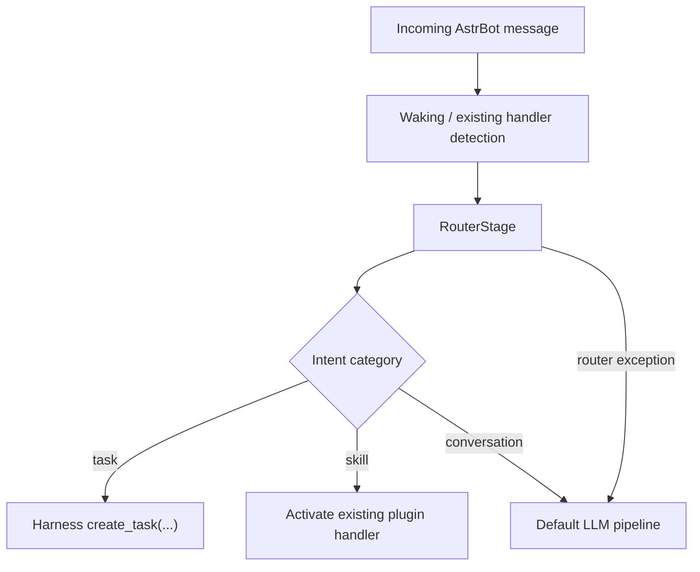

# Router Design

_Implementation note: This design document describes the GPT-delivered Router implementation for `P3_GPT_TASKS.md`._

## Overview

The Router adds a lightweight intent classification layer before the default
LLM request path. Its job is to distinguish between:

- `task`: messages that should create a Harness workflow task
- `skill`: messages that should activate an existing plugin or skill entrypoint
- `conversation`: messages that should continue through the normal chat flow

The implementation is intentionally conservative:

- high-confidence rule matches are handled first
- low-confidence or ambiguous messages can fall back to a single LLM
  classification call
- router failures always fall back to the existing pipeline

## Flow



## Components

### `astrbot/core/router.py`

Contains two main objects:

- `Intent`: the normalized output of the classifier
- `IntentRouter`: loads YAML rules, evaluates them, and optionally triggers the
  LLM fallback

`Intent` fields:

- `category`: `task`, `skill`, or `conversation`
- `intent_type`: a more specific subtype such as `task_intake` or
  `dreamina_image`
- `confidence`: float in the range `0-1`
- `workflow_kind`: set for Harness task routes
- `skill_name`: set for plugin or skill routes
- `metadata`: transport hints, matched command info, and other structured data

### `astrbot/core/router_config.yaml`

This file defines:

- task rules for `/task ...` commands and common workflow phrases
- skill rules for strong plugin signals such as Dreamina image/video phrases
- the compact LLM fallback prompt

Rules are kept in YAML so new skills and workflow kinds can be added without
changing router logic.

### `astrbot/core/pipeline/process_stage/router_stage.py`

This stage is inserted before the normal LLM stage.

Responsibilities:

- short-circuit when an existing handler is already activated
- classify message intent
- create Harness tasks for task intents
- synthesize plugin commands for supported skill routes
- restore the original message after synthetic command activation

### `astrbot/core/pipeline/process_stage/stage.py`

This stage now initializes `RouterStage` and invokes it before the default LLM
request path.

## Rule Strategy

### Strong signals

Strong signals use direct rule matching and should not need an LLM fallback.

Examples:

- `/task new`
- `/task intake marketing_plan`
- `生成图片`
- `生成视频`
- `图片转视频`

### Weak signals

Weak signals rely on keyword intent and may still use the fallback classifier if
confidence stays below the configured threshold.

Examples:

- "帮我做一个推广计划"
- "整理一下这个项目跟进"
- "想做一张海报"

## LLM Fallback

The fallback is triggered when:

- no rule matches, or
- the best rule confidence is lower than `fallback_threshold`

The fallback prompt asks for JSON only and restricts output to the router's
known categories and workflow kinds.

Expected output shape:

```json
{
  "category": "task",
  "intent_type": "task_intake",
  "confidence": 0.81,
  "workflow_kind": "marketing_plan",
  "skill_name": null,
  "metadata": {}
}
```

If the fallback call fails or returns invalid JSON, the router degrades to the
best rule match or `conversation`.

## Current Skill Activation Scope

The router currently auto-activates `dreamina_plugin` by converting weak natural
language requests into a synthetic command string and then reusing the existing
plugin handler registry.

This design keeps the router small and avoids introducing a second plugin
execution path.

Other skill matches are currently classification-only unless they already map to
an existing handler flow.

## Safety And Failure Handling

- Router exceptions are logged and do not block message processing.
- Existing activated handlers take precedence over router classification.
- Synthetic message rewrites are temporary and restored before the default LLM
  stage continues.
- Harness internals are not modified; the router only calls the public
  `create_workflow_request(...)` helper and `harness_engine.create_task(...)`.

## How To Test The Router In Isolation

Example:

```python
from pathlib import Path

from astrbot.core.router import IntentRouter


async def fake_llm(system_prompt: str, prompt: str, context: dict) -> str:
    return '{"category":"conversation","intent_type":"general","confidence":0.4}'


router = IntentRouter.from_yaml(
    Path("astrbot/core/router_config.yaml"),
    llm_provider=fake_llm,
)

intent = await router.classify(
    "帮我做一个营销计划",
    {"platform_id": "qqbot", "session_id": "demo"},
)
print(intent.to_dict())
```

## How To Add A New Workflow Kind

1. Add one or more `task_intents` rules in `router_config.yaml`
2. Set `workflow_kind` to the existing Harness workflow kind
3. Keep confidence high for explicit commands and lower for weak natural
   language phrases
4. If needed, update the fallback prompt so the LLM knows the new workflow kind

## How To Add A New Skill Route

1. Add a `skill_intents` rule in `router_config.yaml`
2. Set `skill_name`
3. If the skill already has an AstrBot command handler, add metadata that lets
   `RouterStage` build a synthetic command
4. If it needs a custom execution path, extend `_handle_skill_intent(...)` in
   `router_stage.py`

## Notes

- The router is a traffic director, not a replacement for existing handlers.
- Keep rule matching explicit and easy to audit.
- Prefer extending YAML rules before adding more Python branching logic.
